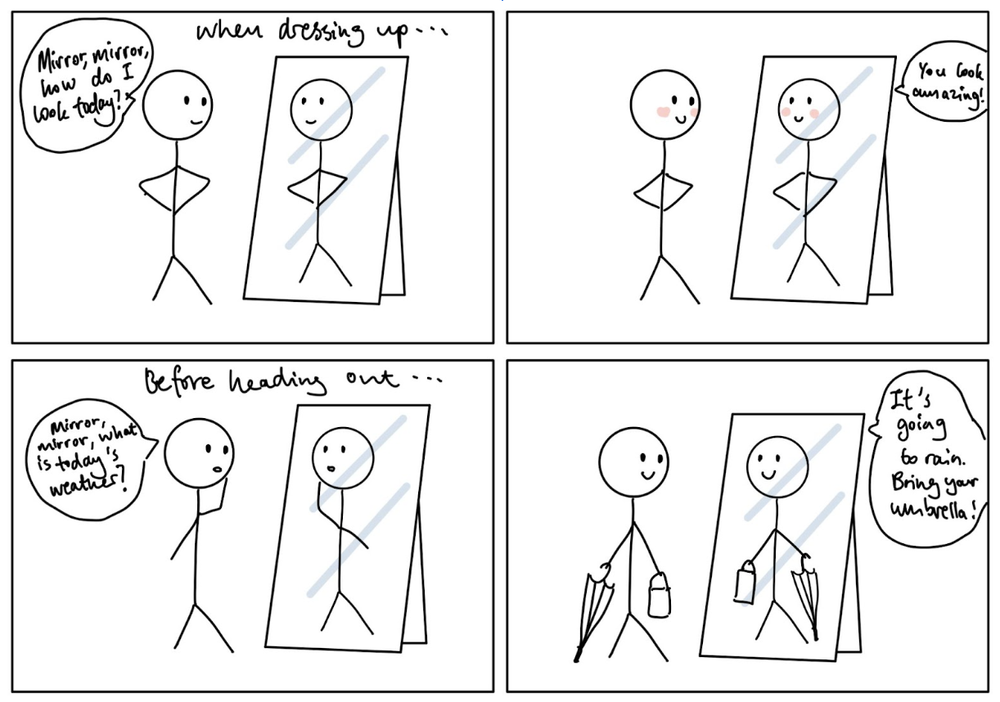

# Chatterboxes

**NAMES OF COLLABORATORS HERE**

Kazim Jafri (khj23)\
Rei Chen (rc884)\
Zixin Li (zl865)\
Rowan Wu (rww99)\
Arystan Tatishev (at855)

### Storyboard

\*\***Post your storyboard and diagram here.**\*\*

Idea 1: Camera Magic Mirror

Idea: Create a smart mirror that responds to voice commands for information. 

Idea 2: Language Interpretter

Idea: Automatically interprets the language you talk in and responds back in the language you input

Idea 3: Automatic Bestie

Idea: Listens to and validates a friend sharing a long-winded story

Idea 4: Starbucks Experience

Idea: Device takes in the order information from the customer. Translates the information into Starbucks style/format, and speaks a messed up version of the customer’s name. 

Write out what you imagine the dialogue to be. Use cards, post-its, or whatever method helps you develop alternatives or group responses. 

\*\***Please describe and document your process.**\*\*

Idea 1: Camera Magic Mirror

Dialogue: \
User: "Mirror,mirror, how do I look today?"\
Smart Mirror: “You look amazing.” \
User: "Mirror, mirror, what should I wear today?"\
Smart Mirror: “You can wear a shirt.”

Idea 2: Language Interpretter

Dialogue: Cómo estás?\
Interpreter: Bien, y tú?\
Dialogue: 好的！今天天氣怎麼樣？\
Interpreter: 氣溫70度，正在下雨。\

Idea 3: Automatic Bestie

Dialogue:\
Pi: How was your day?\
Friend: The craziest thing happened today! [Story…]\
Pi: OMG, no way!\
Friend: [telling story]\
Pi: And then what?\
Friend: she slapped him on the face!\
Pi: Oh no she did NOT! What happened next?\
Friend: [continues story] \
Pi: Uh huh…\
Friend: [finishes story] \
Pi: That’s SO crazy.

Dialogue:\
Friend: [Telling story…] I can’t believe he did that to me.\
Pi: Ugh, he sucks! 

Friend: But I was acting crazy.\
Pi: It wasn’t your fault, girl!\
Friend: You know what, you’re right! Thanks, friend!\
Pi: Any day, I’m on your side!

Idea 4: Starbucks Experience

Dialogue:

Customer: I want a large–\
Device: A venti.\
Customer: Yeah, a venti matcha latte.\
Device: A venti matcha latte.\
Device: What is your name?\
Customer: Rei Chen\
Device: A venti matcha latte for Reiss Creez 

### Acting out the dialogue

Find a partner, and *without sharing the script with your partner* try out the dialogue you've designed, where you (as the device designer) act as the device you are designing.  Please record this interaction (for example, using Zoom's record feature).

\*\***Describe if the dialogue seemed different than what you imagined when it was acted out, and how.**\*\*

Idea 4: Starbucks Experience:\
Video: https://youtu.be/AT-75OkrOAM

Feedback: 
The customer was really surprised when the device interrupted her to correct her to the correct Starbucks name. The customer did not give the last name when the device asked for the customer’s name.

Idea 1: Camera Mirror Interpreter\
Video: https://youtu.be/8VSTWea1uJw

Feedback: 
The user’s response was similar to what we thought they would ask.
However, when we explained what our device is like, we did ask the user to start with the phrase “mirror, mirror” when talking to the device. If we did not ask the user prior to the user testing, they would not know about this. 

# Lab 3 Part 2

For Part 2, you will redesign the interaction with the speech-enabled device using the data collected, as well as feedback from part 1.

## Feedback for Part 1:

- It looks like an interesting system. Being able to figure out what language someone is speaking looks pretty cool. It would be useful to consider some more interactions and how else a user could interact with the system beyond just voice. The keypad could have additional features too.
  
- Very interesting idea. I didn’t know it could speak Russian! Maybe consider or specify the location where the system could be used, like outside of an airport, or for some other things inside of an airport?

## Prep for Part 2

Lab Part 2 - Language Interpreter
Idea: Automatically interprets the language you talk in and responds back in the language you input. This would be useful for travelers in airports, as there are many internationals who prefer to speak in their native language. 

Video: https://youtu.be/9Zqhv5i4gbM

Sensor: respond to user in the language asked

Screen: show loading animation(?) show the what user just said

Keyboard: Record and Stop (Two keys) Record = 1, Stop = 3

Additional Features That We Didn’t Get Working or Didn’t Use in Video:

Keyboard:

 1. Repeat (1 key)

 2. Change volume (2 keys)

 3. Change pitch (2 keys)

 4. Change speed (2 keys)

We also tried to get a loading or waiting screen animation to work, but we failed to integrate it with the overall system. Link to the animation working on its own. Link to animation: https://youtube.com/shorts/ai3GvuPiMso

Script: 
(Russian)
Passenger [in language 1]: What gate is my connecting flight at?
Pi [screen display]: What gate is my connecting flight at?
Pi [audio in language 1]: Please say your flight number.
Passenger: FA3202
Pi [screen display]: FA3202
Pi [screen display + audio]: The connecting flight for FA3202 is at Gate 14. Can I help you with anything else?
Passenger: What are the food options near Gate 14?
Pi [screen display + audio]: There is a McDonald’s 2 minutes from Gate 14, open from 7:00 to 22:00.

Passenger [in language 1]: Здравствуйте, подскажите на каком гейте наш стыковочный рейс?
Pi [screen display]: Здравствуйте, подскажите на каком гейте наш стыковочный рейс?
Pi [audio in language 1]: Пожалуйста назовите ваш номер рейса.
Passenger: FA3202
Pi [screen display]: FA3202
Pi [screen display + audio]: Стыковочный рейс для FA3202 будет на гейт 14. Вам помочь с чем нибудь еще?
Passenger: Есть что-то поесть рядом с моим гейтом?
Pi [screen display + audio]: Есть МакДональдс 2 минуты от гейта 14, открыт с семи утра до десяти вечера.

Passenger [in language 2]: What terminal is baggage claim at? 
Pi [screen display]: What terminal is baggage claim at?
Pi [audio in language 2]: Please state your flight number.
Passenger: CN758
Pi [screen display]: CN758
Pi [screen display + audio in language 2] Baggage claim for flight CN758 is in terminal 2. The closest exit is straight ahead, following signs for Baggage claim.

Passenger [in language 2]: 在哪个航站楼领取行李？
Pi [screen display]: 在哪个航站楼领取行李？
Pi [audio in language 2]: 请告诉我您的航班号
Passenger [in language 2]: CN758
Pi [screen display]: CN758
Pi [screen display + audio in language 2]: CN758 航班的行李提取处位于 2 号航站楼。最近的出口位于正前方，请跟随行李提取标志。

Passenger [in language 3]: Where is the closest Starbucks?
Pi [screen display]: Where is the closest Starbucks?
Pi [screen display + audio in language 3]: The closest Starbucks is 60 meters to the right of this kiosk located next to the restrooms. Can I help you with anything else?

## Test the system
Try to get at least two people to interact with your system. (Ideally, you would inform them that there is a wizard _after_ the interaction, but we recognize that can be hard.)

Answer the following:

### What worked well about the system and what didn't?

What worked well: The device automatically responds to the user in the language it is spoken to, so it does not need the user to manually select a language he/she would like to speak in. 

What didn’t: It might be hard for users to know and speak to the device in their native language as people often would just speak in English in foreign countries if they don’t know the language there. We wanted to display the user's input onto the screen, however we found that Chinese characters could not be displayed. Other languages worked though. 

### What worked well about the controller and what didn't?

What went well: The keypad could be used by the user when he/she approaches our device to start/end recording what they want to say, so the device can respond directly to what the user is asking it, instead of responding to the user’s conversation to other people. 
 
What didn’t: Sometimes there would be lags in the speech from the speaker and text on the screen. 

### What lessons can you take away from the WoZ interactions for designing a more autonomous version of the system?

Understanding the timing of interactions and responses is crucial when transitioning to an autonomous system. Timing can impact user experience and system effectiveness. When there were lags in the device, it made it harder for users to follow through with their actions. 

Additionally, our WoZ interactions would be better with more operators working in coordination. With only one operator as we did, we had to hard-code a lot of our interactions so that the timing would work out and seem smooth, which took away from it being a true WoZ interaction.

### How could you use your system to create a dataset of interaction? What other sensing modalities would make sense to capture?

We can ensure that the device is equipped with multilingual speech recognition capabilities to understand and transcribe user inputs. For hardware, we need a screen for displaying text responses and a speaker for delivering spoken audio responses. We can also record and store transcriptions along with metadata such as the user's language, timestamp, and location within the airport. It is also important to capture contextual information about the interaction, such as the user's location within the airport, the time, and the type of inquiry (e.g., flight information, directions, visa requirements).

In addition to audio and text data, we can consider capturing video data through a webcam to analyze user gestures and facial expressions. Voice recognition technology could also capture tone, such as frustration if the device misunderstands the question. These inputs can provide insights into user satisfaction, helping to enhance the system's performance.
