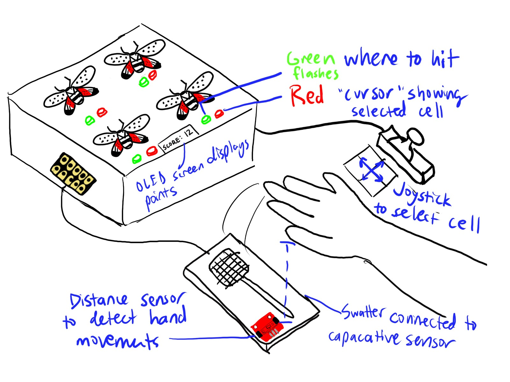

# Ph-UI!!!

**NAMES OF COLLABORATORS HERE**
Kazim Jafri (khj23)
Rei Chen (rc884)
Zixin Li (zl865)
Rowan Wu (rww99)
Arystan Tatishev (at855)


**\*\*\*Sketches of different ways you might use your sensor, and how the larger device needs to be shaped in order to make the sensor useful.\*\*\***

Interactive whack a mole 

- Two distance sensor
- 1 button
- 4 pair of Red & green button to represent mole 

 

Claw machine 

Ice cream game

Snake

One-person band

**\*\*\*What are some things these sketches raise as questions? What do you need to physically prototype to understand how to anwer those questions?\*\*\***

How to implement proximity sensors and accurately quantize the joystick positions.

How accurate distance sensors are when hand is above them

Responsiveness of button


**\*\*\*Pick one of these designs to prototype.\*\*\***

Interactive whack a mole 

### Part D
### Physical considerations for displaying information and housing parts


Here is a Pi with a paper faceplate on it to turn it into a display interface:


This is fine, but the mounting of the display constrains the display location and orientation a lot. Also, it really only works for applications where people can come and stand over the Pi, or where you can mount the Pi to the wall.

Here is another prototype for a paper display:


Your kit includes these [SparkFun Qwiic OLED screens](https://www.sparkfun.com/products/17153). These use less power than the MiniTFTs you have mounted on the GPIO pins of the Pi, but, more importantly, they can be more flexibly mounted elsewhere on your physical interface. The way you program this display is almost identical to the way you program a  Pi display. Take a look at `oled_test.py` and some more of the [Adafruit examples](https://github.com/adafruit/Adafruit_CircuitPython_SSD1306/tree/master/examples).

<p float="left">


</p>


It holds a Pi and usb power supply, and provides a front stage on which to put writing, graphics, LEDs, buttons or displays.

This design can be made by scoring a long strip of corrugated cardboard of width X, with the following measurements:

| Y height of box <br> <sub><sup>- thickness of cardboard</sup></sub> | Z  depth of box <br><sub><sup>- thickness of cardboard</sup></sub> | Y height of box  | Z  depth of box | H height of faceplate <br><sub><sup>* * * * * (don't make this too short) * * * * *</sup></sub>|
| --- | --- | --- | --- | --- | 

Fold the first flap of the strip so that it sits flush against the back of the face plate, and tape, velcro or hot glue it in place. This will make a H x X interface, with a box of Z x X footprint (which you can adapt to the things you want to put in the box) and a height Y in the back. 

Here is an example:


Think about how you want to present the information about what your sensor is sensing! Design a paper display for your project that communicates the state of the Pi and a sensor. Ideally you should design it so that you can slide the Pi out to work on the circuit or programming, and then slide it back in and reattach a few wires to be back in operation.
 
**\*\*\*Sketch 5 designs for how you would physically position your display and any buttons or knobs needed to interact with it.\*\*\***


**\*\*\*What are some things these sketches raise as questions? What do you need to physically prototype to understand how to anwer those questions?\*\*\***


**\*\*\*Pick one of these display designs to integrate into your prototype.\*\*\***


**\*\*\*Explain the rationale for the design.\*\*\*** (e.g. Does it need to be a certain size or form or need to be able to be seen from a certain distance?)

Build a cardboard prototype of your design.


**\*\*\*Document your rough prototype.\*\*\***


LAB PART 2

### Part 2

Following exploration and reflection from Part 1, complete the "looks like," "works like" and "acts like" prototypes for your design, reiterated below.

### Part E (Optional)
### Servo Control with Joystick

> **_NOTE:_**  Not in the kit yet.

In the class kit, you should be able to find the [Qwiic Servo Controller](https://www.sparkfun.com/products/16773) and [Micro Servo Motor SG51](https://www.adafruit.com/product/2201). The Qwiic Servo Controller will need external power supply to drive, which is included in your kit. Connect the servo controller to the miniPiTFT through qwiic connector and connect the external battery to the 2-Pin JST port (ower port) on the servo controller. Connect your servo to channel 2 on the controller, make sure the brown is connected to GND and orange is connected to PWM.


In this exercise, we will be using the nice [ServoKit library](https://learn.adafruit.com/16-channel-pwm-servo-driver/python-circuitpython) developed by Adafruit! We will continue to use the `circuitpython` virtual environment we created. Activate the virtual environment and make sure to install the latest required libraries by running:

```
(circuitpython) pi@ixe00:~/Interactive-Lab-Hub/Lab 4 $ pip3 install -r requirements.txt
```

A servo motor is a rotary actuator or linear actuator that allows for precise control of angular or linear position. The position of a servo motor is set by the width of an electrical pulse, that is, we can use PWM (pulse-width modulation) to set and control the servo motor position. You can read [this](https://learn.adafruit.com/adafruit-arduino-lesson-14-servo-motors/servo-motors) to learn a bit more about how exactly a servo motor works.


Now that you have a basic idea of what a servo motor is, look into the script `servo_test.py` we provide. In line 14, you should see that we have set up the min_pulse and max_pulse corresponding to the servo turning 0 - 180 degrees. Try running the servo example code now and see what happens:


```
(circuitpython) pi@ixe00:~/Interactive-Lab-Hub/Lab 4 $ python servo_test.py
```

It is also possible to control the servo using the sensors mentioned in as in part A and part B, and/or from some of the buttons or parts included in your kit, the simplest way might be to chain Qwiic buttons to the other end of the Qwiic OLED. Like this:

<p align="center"> </p>

You can then call whichever control you like rather than setting a fixed value for the servo. For more information on controlling Qwiic devices, Sparkfun has several python examples, such as [this](https://learn.sparkfun.com/tutorials/qwiic-joystick-hookup-guide/all#python-examples).

We encourage you to try using these controls, **while** paying particular attention to how the interaction changes depending on the position of the controls. For example, if you have your servo rotating a screen (or a piece of cardboard) from one position to another, what changes about the interaction if the control is on the same side of the screen, or the opposite side of the screen? Trying and retrying different configurations generally helps reveal what a design choice changes about the interaction -- _make sure to document what you tried_!


### Part F (Optional)
### Camera
You can use the inputs and outputs from the video camera in the kit. 
We provide another script called camera_test.py to test the USB camera on raspberry pi. 
It uses qt to render a video to the screen, so it is necessary to connect a screen or to connect via VNC to run this script. 

First install some more dependencies into your virtual environment. OpenCV should already be installed on the Pi for the super user. 

```
sudo apt-get install portaudio19-dev python-all-dev
pip install opencv-python pyaudio pygame
```

Once executed the script will render the camera output, press 'q' to stop video and record a sound through the microphone which will be played back by specificing the audio output. 

---
The video is rendered locally on the pi. For wizarding interactions and prototyping it can be necessary to stream the video to another device such as your laptop. A wizard, observing the user and acting as a computer vision algorithm, can then trigger interactions remotley, such as we did in the tinkerbelle lab.

The following resources are good starts on how to stream video: 
* [OpenCV – Stream video to web browser/HTML page](https://pyimagesearch.com/2019/09/02/opencv-stream-video-to-web-browser-html-page/)
* [Live video streaming over network with OpenCV and ImageZMQ](https://pyimagesearch.com/2019/04/15/live-video-streaming-over-network-with-opencv-and-imagezmq/)
### Part G

### Record

Document all the prototypes and iterations you have designed and worked on! Again, deliverables for this lab are writings, sketches, photos, and videos that show what your prototype:
* "Looks like":
  
For this lab we made a whack a mole, but we changed the moles to flies. The device is made out of cardboard. It is a box with 4 pairs of LEDs attached on top of it. We put flies over the LEDs so the flies light up. There is also a swatter on the side for the users to hit the flies.
  
* "Works like": shows what the device can do

Each game is timed, the user's aim is to hit as many flies as they can in the time limit. The red LEDs on the device lights up to show which flies the users should hit. The green LED lights up to indicate that the fly has been hit. A score of the user will be displayed at the end.
  
* "Acts like": shows how a person would interact with the device

The user can hit the fly using the swatter at the side. He/she needs to hit the fly that lights up red.
  
Rough prototype video: https://youtu.be/bCWgo63QzWM

Final Video: https://youtu.be/XiAZwO4ZLEY


